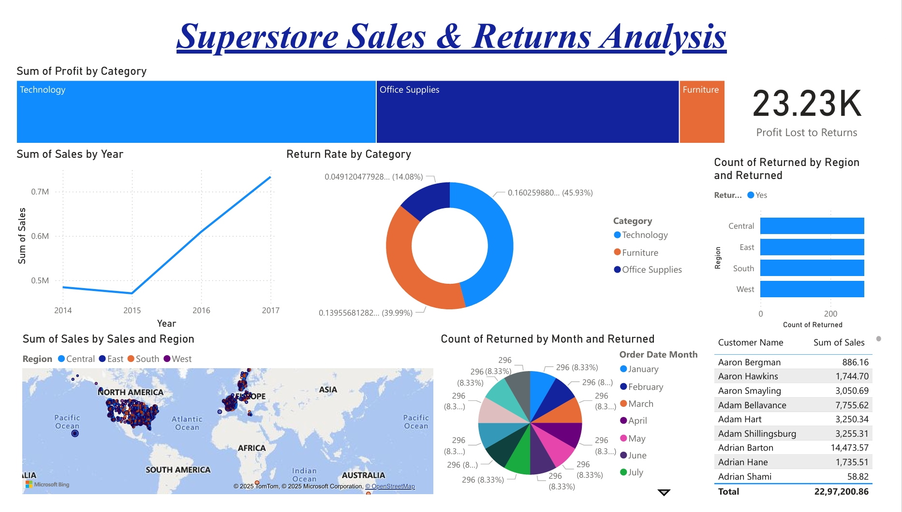

# Superstore Sales & Returns Analysis

This project analyzes sales and return performance using the Superstore dataset.  
The dashboard highlights sales by category, region, and year, along with return trends and profit impact.

## Dashboard

## Key Insights
- The **Technology** category generates the highest profit but also records the highest return rate (~46%), indicating potential issues with product durability or customer satisfaction.  
- **Sales growth** has been consistent year-on-year, peaking in 2017, which shows increasing demand and effective business expansion.  
- Returns occur across all regions, but the **East and Central regions** show a slightly higher return count, which may suggest regional supply chain or service quality issues.  
- Profit lost due to returns amounts to approximately **23.23K**, signaling the importance of addressing product quality and logistics to minimize financial losses.  

## Methodology
1. Imported the Superstore dataset into Power BI.  
2. Converted the order date field into a Month-Year format for time-series analysis.  
3. Created multiple visuals to represent performance:  
   - Line Chart: Sales trend by year  
   - Bar Chart: Sales by region  
   - Donut Chart: Return rate by category  
   - Map: Sales distribution by geography  
4. Applied filters and slicers for category and region to enable interactivity.  
5. Summarized key insights for decision-making.  

## Tools and Technologies
- **Power BI** for data visualization and dashboard design  
- **Excel/CSV dataset** (Superstore Sales) containing Order Date, Region, Category, Sales, and Profit  
- **Data cleaning** performed within Power BI to format dates and handle categorical data  

## Conclusion
The analysis reveals that while sales and profits are growing steadily, high return rates—especially in the Technology category—are impacting overall profitability. Addressing product issues, improving customer experience, and strengthening regional operations could significantly reduce returns and enhance profit margins.

Author

**Srusti** 
