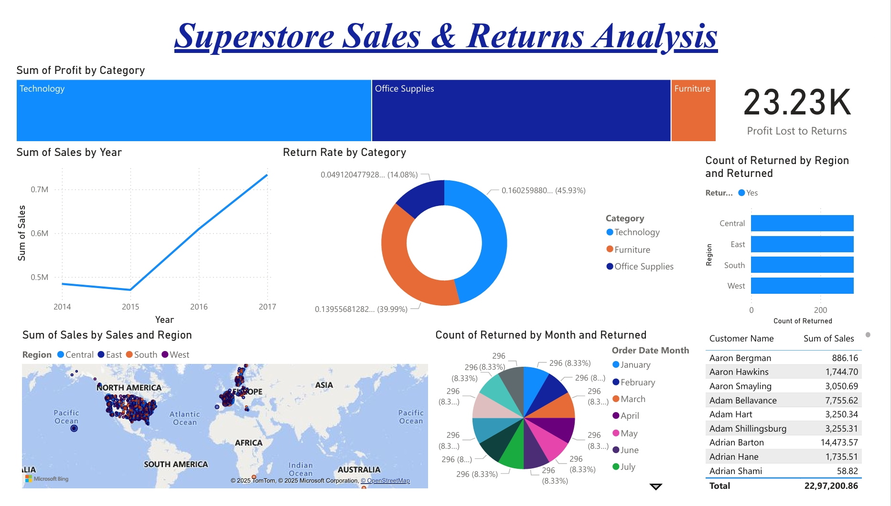

# Superstore Sales & Returns Analysis

This project explores sales and returns performance using the Superstore dataset.  
The dashboard provides insights into **sales by category, region, year**, and **return rates**.

## 📊 Dashboard

## 🔍 Key Insights
- **Technology** category contributes the highest profit but also has the **highest return rate** (~46%).  
- **Sales growth** has been steady year-on-year, with a peak in 2017.  
- Returns are distributed across all regions, but **East and Central** show slightly higher counts.  
- Total profit lost due to returns amounts to **23.23K**, highlighting the need for quality and logistics improvements.

## 🛠 Tools Used
- Power BI for data visualization  
- Dataset: Superstore Sales (Order Date, Region, Category, Sales, Profit)  

---
